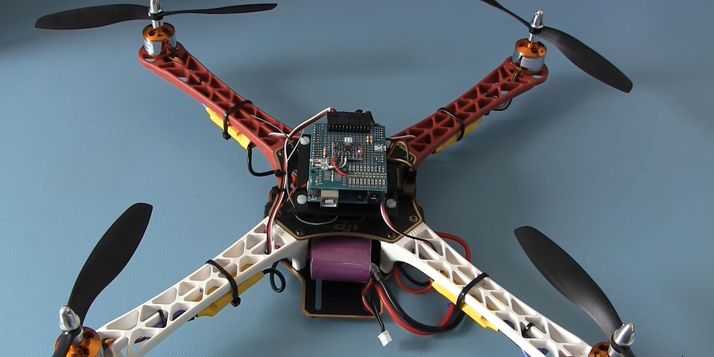

<h1> What is this project? </h1>

This is an auto-leveling **Arduino Uno based quadcopter drone** that is easy to build and fun to fly. Auto leveling means that, when you release the sticks the quadcopter levels itself.

The total cost to build a quadcopter like this is approximately $150 if you use the hardware list below. This includes a battery, transmitter, charger, etc.

The purpose of it is to provide a simple and understandable code that is needed to build an Arduino based auto-level quadcopter flight controller.

The code is well commented and clearly explained

<h1> Steps </h1>

1. Dowload This [Project](https://codeload.github.com/Rxmsey/Arduino-Quadcopter-Drone-/zip/refs/heads/main)

2. Download [Arduino IDE](https://downloads.arduino.cc/arduino-nightly-windows.zip)

2. Read the explanation within the [Building step by step.txt](https://github.com/Rxmsey/Arduino-Quadcopter-Drone-/blob/main/Building%20step%20by%20step.txt) file
 

<h1> Terms of use </h1>

THE SOFTWARE IS PROVIDED "AS IS", WITHOUT WARRANTY OF ANY KIND, EXPRESS OR
IMPLIED, INCLUDING BUT NOT LIMITED TO THE WARRANTIES OF MERCHANTABILITY,
FITNESS FOR A PARTICULAR PURPOSE AND NONINFRINGEMENT. IN NO EVENT SHALL THE
AUTHORS OR COPYRIGHT HOLDERS BE LIABLE FOR ANY CLAIM, DAMAGES OR OTHER
LIABILITY, WHETHER IN AN ACTION OF CONTRACT, TORT OR OTHERWISE, ARISING FROM,
OUT OF OR IN CONNECTION WITH THE SOFTWARE OR THE USE OR OTHER DEALINGS IN
THE SOFTWARE.

<h1> Safety note </h1>

Always remove the propellers and stay away from the motors unless you 
are 100% certain of what you are doing.

<h1> Steps: <h1>

 <h4> Step 1 - Software: <h4>
  
Download the Arduino IDE from here:

https://downloads.arduino.cc/arduino-nightly-windows.zip

you will have to run the scripts with the arduino IDE

<h4> Step 2 - Hardware: <h4>
 
I made the following hardware list for your convenience. This list is a suggestion and it's your own responsibility to ensure that the products meet your specific requirements. But this list should be sufficient to build the quadcopter.

1 x: 450 size frame with integrated power distribution board
4 x: 1000kV motor / 10x4.5 props / ESC combo
1 x: 3S / 2200mAh / 20C lipo
1 x: Arduino Uno or Funduino Uno
1 x: MPU-6050 gyro / accelerometer
1 x: Flysky FS-i6 6-CH TX Transmitter
1 x: 2S/3S lipo battery charger

I personally prefer (and use) 8x4.5 inch props instead of the 10x4.5 inch props. This to offload the motors and ESC's and to get a better response.

<h4> Step 3 - The build: <h4>
 
checkout the `schematic .png` picture to find out how to connect the parts its very simple so don't worry 
 
 

<h6> 3.1 MPU-6050 gyro/accelerometer:<h6>
 
The only supported gyroscope is MPU-6050. This is because the auto-level feature requires an accelerometer and a gyro 
The orientation of the gyro is not important as long as the Z-axis is vertical (perpendicular to the surface) and the edges of the gyro are aligned with the edges of the quadcopter. Click on the image to see all the possible gyro orientations.

<h6>3.2 The tranmitter and receiver:<h6>
 
Almost every 4 channel RC transmitter can be used for this drone. The most important feature is the used receiver output pulse. The range should be approximately 1000 till 2000 with a 1500 center position.

Check the manual of the specific transmitter / receiver for details. For example, the following transmitter should work fine with the this drone:

1 x Flysky FS-T6 6-CH TX Transmitter
Connect the roll (aileron), pitch (elevator), yaw (rudder) and throttle output of the receiver to the Arduino Uno ports 8, 9, 10 and 11. The order is not important as the setup software will recognize each separate channel. Check the manual of the transmitter / receiver to see which receiver port is connected to the specific function.

The receiver is powered by the +5V output of the Arduino. The connection can be found on the schematic (top left corner 'Receiver power').

<h6>3.3 The ESC's:<h6>
 
On the schematic only the ground and the signal wires of the ESC's are connected. This is correct. The +5V from the ESC is not connected because the Arduino gets its power directly from the flight battery via the diode D1.

In some cases the ground of the ESC doesn't have to be connected. Check with a multimeter if the ground of the battery connection is connected to the ground / - of the esc connection wire. If these are connected the ground of the ESC does not need to be connected to the Arduino because they share the same battery ground.

The signal wire of the ESC's are connected to the digital outputs 4, 5, 6 and 7 of the Arduino as shown in the table below. Also check the direction of rotation.

`Arduino  	Location    	Direction of rotation
D4	right front  	counter clockwise
D5	right rear	clockwise
D6	left rear	counter clockwise
D7	left front	clockwise`

<h4>Step 4 - Run the setup software<h4>
 
Remove the props, don't connect the flight battery and upload the setup program to the Arduino Uno. Open the serial monitor at 57600baud and complete the setup by executing the requested actions.

After the setup is completed all the settings are stored in the EEPROM of the Arduino.

<h4> Step 5 - Receiver and gyro check <h4>
To make sure that everything is working correct it's necessary to run some basic checks. Remove the props, disconnect the flight battery and upload the ESC calibration program to the Arduino. Open the serial monitor at 57600baud.

<h6>5.1 Receiver input check<h6>
                                
Send the letter 'r' to start the receiver monitor. Now move the sticks and see if the values on the screen correspond with the movements of the sticks.

All the channels should read 1000us till 2000us with a center position of 1500 (+/-8).

<h6> 5.2 Gyro / accelerometer angle check <h6>
After the receiver check is completed send the letter 'a' to start the angle check.

Don't move the quadcopter because the gyro needs to calibrate itself. After the calibration the roll and pitch angles are shown. The yaw value is the output of the gyro and will go back to zero if the yaw rotation stops.

Check if the angles correspond with the movement of the quadcopter:
Nose up is positive pitch and nose down is negative pitch.
Left wing up is positive roll and left wing down is negative roll.
Nose right is positive yaw and nose left is negative yaw.

<h4> Step 6 - Calibrate the ESC's <h4>
Electronic speed controllers or ESC's for short are controlled with a 1000us till 2000us pulse. 1000us means off and 2000us means full throttle. To make sure that all the ESC's react the same way it's important to calibrate the 1000us and 2000us point. Without calibration the motors will perform different and the quadcopter doesnt fly well or might even crash.

Remove the props and upload the ESC calibration program to the Arduino. Disconnect the USB cable and follow the instructions in the manual to calibrate the ESC's.

In most cases this is done with the following steps:

Place the throttle stick in the upper position (full throttle)
Connect the flight battery
After some beeps place the throttle stick in the lowest position
Disconnect the flight battery
But again, check the manual of your specific ESC for the correct calibration procedure.

<h4> Step 7 - balance the motors and props <h4>
 
SAFETY NOTE:
This is the first time that the motors will run with the mounted props. Make sure that a save operation is possible. YOU ARE SOLELY RESPONSIBLE FOR YOUR OWN SAFETY.

<h6> 7.1 Why is balancing the props important?<h6>
 
Balancing the props is incredibly important! Without well balanced props and motors the gyro and accelerometer will produce noise that makes the motors react jerky. There is minimal stability and the quadcopter can't level itself.

To get the best performance the props and motors need to be balanced perfectly. Putting the gyro / accelerometer on vibration dampeners does not help and can only make things worse.

<h6> 7.2 How to balance the props by using the this drone software <h6>
 
Mount the props on the motors and check if the counter clock wise and clock wise props are in the right position. Upload the ESC calibration program and open the Arduino serial monitor at 57600baud. Send '1' via the serial monitor and wait for the response "Test motor 1 (right front CCW.)".

The numbers that are printed on the screen represents the amount of vibration measured by the accelerometer. This is not a standardized value and should only be used to minimize the amount of vibration of your quadcopter.

Hold the quadcopter firmly down, place the throttle in the lowest position and connect the flight battery. Now slowly increase the throttle until motor 1 starts to spin. Check the direction of rotation and that the prop produces upward thrust. If the motor rotates in the wrong direction you need to switch two of the three motor wires. Put the throttle in the lowest position to stop the motor.

Now hold the motor frame firmly in your hand and increase the throttle to half throttle. Check the numbers on the screen and also memorize the vibrations that you feel with you hand that is holding the motor frame.

Stop the motor and put a small piece of tape on one of the blades and run the test again. Check if the vibrations reduce. If nor try a piece of tape on the other blade. Keep doing this until the motor and prop run as smooth as possible. This can sometimes be a daunting task but the reward is a very stable flying quadcopter. So take your time and get it perfect!

When done with motor 1, send a '2' via the Arduino IDE and start the process again for motor / prop 2. And after that, send a '3' for motor number 3 and a '4' for motor 4.

By sending a '5' all the motors will run together as a final test.

<h4> Step 8 - Upload the flight controller software <h4>
 
Disconnect the flight battery and upload the flight controller software to the Arduino. Disconnect the USB cable and connect the flight battery.

Hold the quadcopter firmly in your hand and start the motors with the following sequence:

Start = throttle down and yaw left
Stop = throttle down and yaw right

Increase the throttle up to the point when it almost starts to become weightless. The quadcopter should now try to level itself. If you move the quad it should start to counteract the movement until it is level again.

When the roll or pitch stick of the transmitter is moved the quadcopter should move in the same direction. If this is not the case redo the setup procedure and double check all the points on this page.

When all is good it is time for a careful first test flight. Always fly the quadcopter outdoor and over grass for safety. Grass will minimize the damage during a crash.

